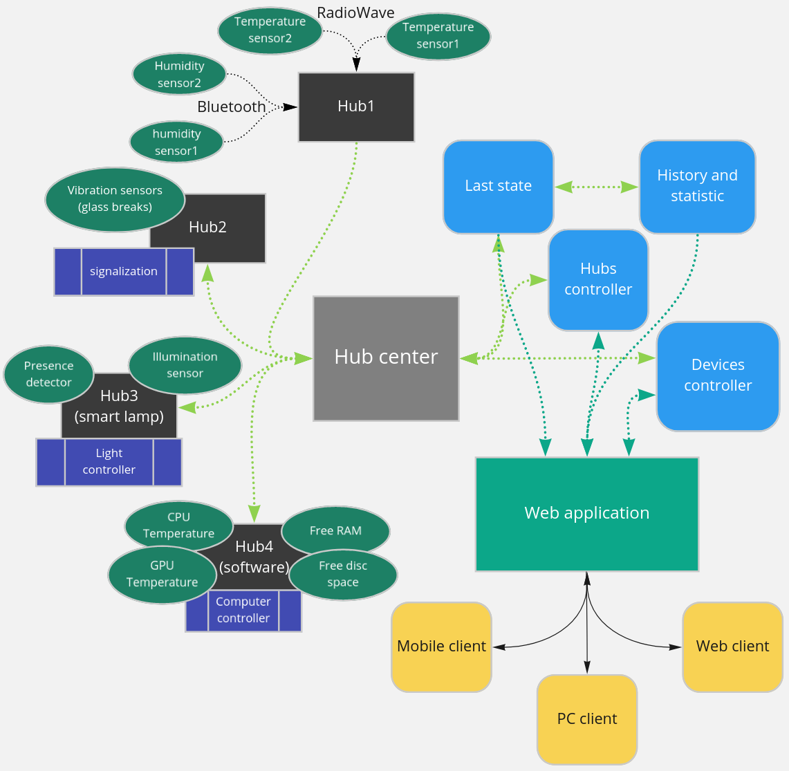

# Smart home




## Communication between components

### Hub messages

Hub can produce several types of messages:
1. [Hub start](#hub-start)
2. [Hub stop](#hub-stop)
3. [Hub message](#hub-message)
4. [Heart beat](#heart-beat)
5. [Devices connected](#devices-connected)
6. [Devices messages](#devices-messages)
7. [Devices disconnected](#devices-disconnected)

<b> Note that each message contains "hub-id" header ! </b>
<p> Field "action" is a shortcut for the MessageAction </p>

#### Hub start
This message must be sent firstly to identify hub. <br>
Field "data" contains hub description and extra properties like heart beat period (hb)
```json
    {
        "hub-id": "hub1",
        "action":"start",
        "data": "{\"description\":\"test-hub\", \"hb\":30}"
    }
```

#### Hub stop
Field "data" contains disconnection reason 
```json
    {
        "hub-id": "0b97d1b9-9759-4adc-b9a6-b885e1e9b872",
        "action":"off",
        "data":"Hub is shutting down"
    }
```

#### Hub message
Reserved for the future ... <br>
Notify about some changes in configuration or handle some user request and send response 
```json
    {
        "hub-id": "0b97d1b9-9759-4adc-b9a6-b885e1e9b872",
        "action":"hub-msg",
        "data": "important message"
    }
```

#### Heart beat
Hub must produce heart beat message with fixed period. For instance, each 30 seconds
```json
    {
        "hub-id": "0b97d1b9-9759-4adc-b9a6-b885e1e9b872",
        "action":"alive",
        "data": "{\"ts\":1652919949,\"alive-devices\":5,\"total-devices\":10}"
    }
```

#### Devices connected
Hub must send notification on device connection
 * **hub-id** - const hub uuid
 * **device-id** - const device uuid 
 * **type** - device type. Starts with "ACTUATOR__" or "SENSOR__"
 * **name** - custom device name
 * **data** - additional information can pe passed here as string (in json format)
 
```json
    {
        "hub-id": "0b97d1b9-9759-4adc-b9a6-b885e1e9b872",
        "device-id":"ada9ff04-ed3f-470f-9c30-23068b9b8c02",
        "action": "device-connected",
        "data":"{\"unit\":\"celsius\",\"type\":\"SENSOR__thermometer\",\"name\":\"temperature imitator1\"}"
    }
```

#### Devices messages
 * **hub-id** - const hub uuid
 * **device-id** - const device uuid 
 * **data** - parsed information given from device and presented as a string in json format

```json
    {
        "hub-id": "0b97d1b9-9759-4adc-b9a6-b885e1e9b872",
        "device-id":"ada9ff04-ed3f-470f-9c30-23068b9b8c02",
        "action":"msg",
        "data": "some data"
    }
```


#### Devices disconnected
Hub must send notification on devices disconnection
* **hub-id** - const hub uuid
* **device-id** - const device uuid 
* **data** - - disconnection reason

```json
    {
        "hub-id": "0b97d1b9-9759-4adc-b9a6-b885e1e9b872",
        "device-id":"ada9ff04-ed3f-470f-9c30-23068b9b8c02",
        "action":"devices-disconnected",
        "data": "connection lost"
    }
```